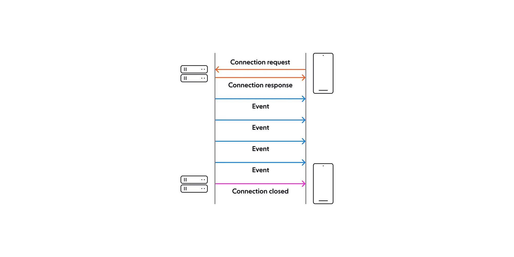

# **Prototype Server-Sent Events**

**Server-Sent Events (SSE)** is a unidirectional communication technique where the server pushes updates to the client over a single persistent connection. The client establishes the connection using HTTP, and the server sends updates whenever new data is available in a standardized format. SSE is efficient for real-time updates because it eliminates the need for continuous client polling and supports automatic reconnection.



## 💻 General

### 🗃️ Repository

Clone the repository.

```bash
git clone git@github.com:tyronejosee/prototype_sever_sent_events.git
```

## 🛠️ Backend

### ⚙️ Installation

Activate the virtual environment:

```bash
pipenv shell
```

Install dependencies:

```bash
pipenv install
pipenv install --dev
```

Verify dependencies:

```bash
pipenv graph
```

Run the development server using `uvicorn`:

```bash
uvicorn core.asgi:application --host 127.0.0.1 --port 8000
```

Or using `daphne`:

```bash
daphne -b 127.0.0.1 -p 8000 core.asgi:application
```

Run the migrations:

```bash
python manage.py migrate
```

Create a superuser to access the entire site without restrictions:

```bash
python manage.py createsuperuser
```

Log in to `admin`:

```bash
http://127.0.0.1:8000/admin/
```

## 🎨 Frontend

The front end of the application was created with [Next.js](https://nextjs.org/) using the App Router introduced in Next.js 13 and the package manager [PNPM](https://pnpm.io/).

### ✅ Requirements

- [Node.js](https://nodejs.org/) >= 16.8.0
- [PNPM](https://pnpm.io/installation) >= 7.0

### ⚙️ Installation (Front-end)

To get started, make sure you have [PNPM](https://pnpm.io/installation) installed on your system. Then, follow these steps:

Navigate to the `frontend` folder:

```bash
cd ./frontend/
```

Install the dependencies:

```bash
pnpm install
```

### Available Scripts

Start the development server at `http://localhost:5173/`:

```bash
pnpm dev
```

Enjoy! 🎉
